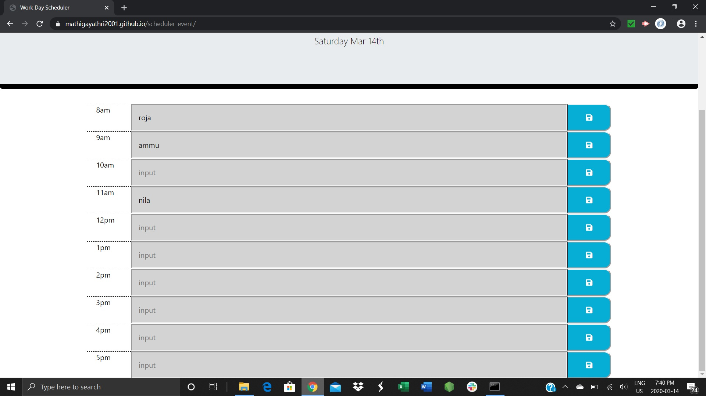

# This site will be used to schedule the daily events between 8 am to 5pm

# Based on the local time while enter the events, the timeslots colors were populated with present,future and past

# Entered event information will be stored in the local storage

# When the page reloaded, previous stored local storage information will be get and stored in the event slots.

# link to url = https://mathigayathri2001.github.io/scheduler-event/

# 
# 